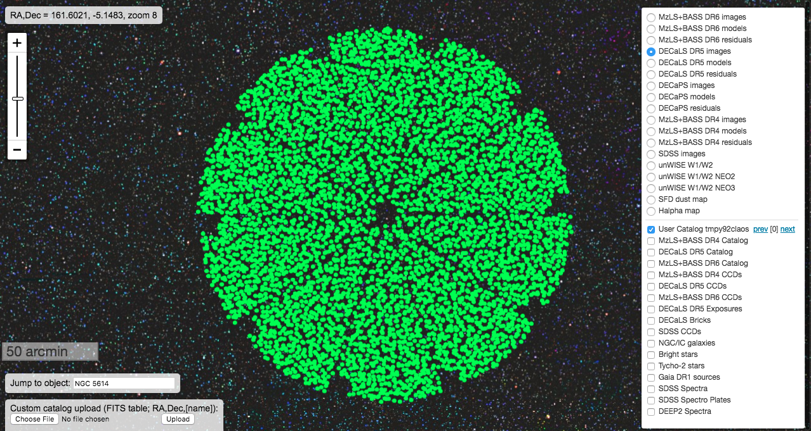
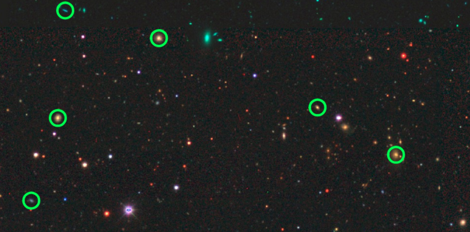

# fiberassign on DR5

Running fiberassign on DECaLS data (DR5) using a single python script.

To run the script do the following in a login node on cori@NERSC.

```
source /project/projectdirs/desi/software/desi_environment.sh
```

```
git clone https://github.com/forero/decals_fiberassign_hack
```

```
cd decals_fiberassign_hack
```

```
python main.py
```

After that you can use visualize a single pointing file (i.e. `output/bright/tile_30900.fits`)
using http://legacysurvey.org/viewer/




